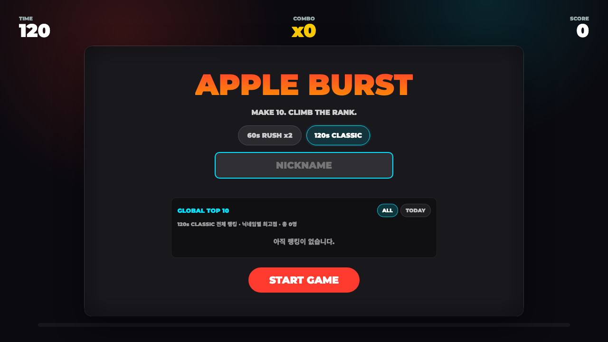

# Apple Burst

A fast static browser game where players burst apples, chase combos, and compete on a Firebase Realtime Database leaderboard.



## Highlights

- Single-file HTML game
- Canvas-based gameplay
- Global top 10 ranking
- Nickname-based best score storage
- Netlify-ready static deployment

## Tech Stack

- HTML
- CSS
- JavaScript
- Firebase Realtime Database
- Netlify

## Deploy on Netlify

1. Open Netlify.
2. Add new site.
3. Choose manual deploy.
4. Drag this folder into Netlify.

No build command is needed. Netlify reads `netlify.toml` and publishes this folder.

## Local Preview

Open `index.html` in a browser.

The game runs without Firebase. To enable the global ranking locally or in a static deployment, copy the example config and fill it with your Firebase web app values:

```sh
cp firebase-config.example.js firebase-config.js
```

`firebase-config.js` is intentionally ignored by Git.

## Firebase Rules

Copy `firebase-rules.json` into Firebase Console > Realtime Database > Rules, then publish.

The ranking stores one best score per nickname key and shows the global top 10.
