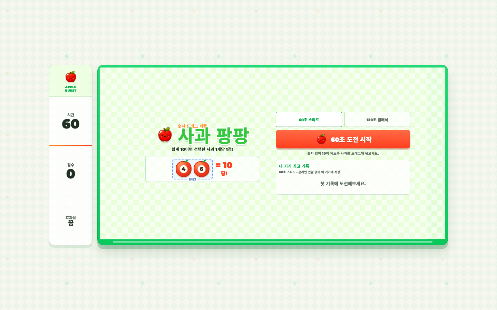

# 사과 팡팡

숫자가 적힌 사과를 드래그해 합계 10을 만드는 반응형 브라우저 퍼즐 게임입니다. 모바일에서는 세로 전체화면, 데스크톱에서는 가로형 게임판으로 실행됩니다.

- 운영 주소: https://seung-won-yu.github.io/apple-burst/
- 현재 운영 모드: 오프라인 우선, 기기별 최고점 저장
- 온라인 랭킹: 비활성

## 화면

| 모바일 세로 | 데스크톱 가로 |
| --- | --- |
|  |  |

## 게임 규칙

1. 사과가 포함되도록 사각형을 드래그합니다.
2. 선택한 숫자의 합이 정확히 `10`이면 사과가 터집니다.
3. 제거한 사과 한 개당 `1점`을 얻습니다.
4. 가능한 조합이 없거나 사과가 얼마 남지 않으면 게임판이 자동으로 섞입니다.
5. 제한 시간이 끝나면 최고점이 현재 브라우저에 저장됩니다.

게임 모드:

- `60초 스피드`
- `120초 클래식`

## 반응형 설계

게임 규칙과 전체 사과 수는 같고 화면 방향에 맞춰 배치만 변경됩니다.

| 환경 | 게임판 | HUD | 시작 화면 |
| --- | --- | --- | --- |
| 모바일 | `6열 × 12행` | 상단 가로 HUD | 세로 단일 흐름 |
| 데스크톱 | `12열 × 6행` | 왼쪽 세로 HUD | 좌우 2열 구성 |

모바일:

- 세로 화면 높이에 맞춰 게임판 크기 자동 계산
- 큰 사과와 숫자를 유지하면서 안전 영역 대응
- 시작 버튼에서 전체화면과 세로 방향 고정 요청
- 낮은 가로 화면에서는 세로 전환 안내

데스크톱:

- 900px 이상, 정밀 포인터 환경에서 가로형 게임판 적용
- 시간·점수·효과음을 왼쪽 HUD에 배치
- 시작·게임·결과 화면을 가로 화면에 맞게 확장

## 시작과 피드백

- 시작 화면에서 `4 + 6 = 10` 드래그 규칙 미리보기
- 시작 화면에서 60초 또는 120초 모드 선택
- 드래그 중 현재 합계를 `현재 합 / 10`으로 표시
- 정답, 실패, 자동 섞기를 애니메이션과 진동으로 구분
- 점수 증가 애니메이션과 남은 시간 진행선 제공
- 마지막 10초 HUD 경고, 마지막 5초 카운트 효과음
- 신기록과 일반 종료 결과를 분리

## 효과음

효과음은 외부 음원 파일 없이 Web Audio API로 합성합니다.

| 상황 | 효과 |
| --- | --- |
| 효과음 켜기 | 밝은 2음 확인 |
| 게임 시작 | 상승하는 3음 |
| 정답 | 사과 팝과 짧은 고음 |
| 실패 | 낮게 내려가는 음 |
| 자동 섞기 | 위로 훑는 반짝임 |
| 마지막 5초 | 매초 짧은 카운트 |
| 일반 종료 | 내려가는 2음 |
| 신기록 | 상승하는 4음 팡파르 |

현장에서 여러 기기가 동시에 재생되는 상황을 고려해 효과음 기본값은 `OFF`입니다.

## QR 실행

발표 자료:

- [QR 원본](docs/apple-burst-qr.png)
- [16:9 발표용 QR 슬라이드](docs/apple-burst-qr-slide.png)

QR과 README는 모두 동일한 운영 주소를 사용합니다.

주소창 관련:

- 브라우저 정책상 QR 접속 즉시 주소창을 강제로 숨길 수는 없습니다.
- 시작 버튼을 누르면 전체화면을 요청합니다.
- 홈 화면에 추가해 실행하면 `manifest.webmanifest`의 전체화면 설정을 사용할 수 있습니다.

## 오프라인 우선 구조

```text
GitHub Pages
→ 정적 HTML / JavaScript / 이미지 로드
→ 브라우저에서 게임 실행
→ localStorage에 모드·효과음·기기 최고점 저장
```

현재 `ONLINE_RANKING_ENABLED = false`이므로 Firebase SDK를 불러오거나 Realtime Database에 요청하지 않습니다. 약 200명이 동시에 접속해도 플레이 중 데이터베이스 읽기·쓰기는 발생하지 않습니다.

## 로컬 실행

```sh
python3 -m http.server 4174
```

- 실행 주소: http://localhost:4174/

## 검증

규칙 단위 테스트:

```sh
node --test tests/game-rules.test.js
```

수동 또는 브라우저 QA 항목:

- 모바일 320×568, 360×740, 390×844, 430×932
- 데스크톱 900×600, 1024×640, 1440×900
- 시작, 10회 연속 드래그, 실패, 자동 섞기, 종료, 재시작
- 기기 최고점 저장과 새로고침 복원
- 효과음 전체 큐와 음소거
- 가로 회전 안내, 레이아웃 넘침, 브라우저 오류
- Firebase 네트워크 요청 없음

## 배포

`main` 브랜치에 푸시하면 `.github/workflows/deploy-pages.yml`이 GitHub Pages에 배포합니다.

저장소 설정:

1. `Settings > Pages`
2. `Build and deployment > Source`
3. `GitHub Actions` 선택

## Firebase

Firebase 코드는 온라인 랭킹을 다시 열 때를 위해 보존되어 있지만 현재는 비활성입니다.

- Project ID: `apple-game-d1038`
- Realtime Database: `apple-game-d1038-default-rtdb`
- Database URL: `https://apple-game-d1038-default-rtdb.asia-southeast1.firebasedatabase.app`
- 현재 점수 버전: `v8`

온라인 랭킹을 재개하려면 Firebase SDK 로드, `firebase-config.js`, `ONLINE_RANKING_ENABLED`와 배포 규칙을 함께 검토해야 합니다.

규칙 배포:

```sh
npx firebase-tools deploy --only database --project apple-game-d1038
```

## 주요 파일

```text
index.html                       게임 UI, 캔버스, 입력, 효과음, 반응형 레이아웃
game-rules.js                    점수 규칙과 점수 버전
manifest.webmanifest             홈 화면 / 전체화면 설정
firebase-rules.json              보존된 온라인 랭킹 규칙
tests/game-rules.test.js         점수 규칙 테스트
docs/                            QR과 화면 이미지
.design/responsive-premium/      반응형 리디자인 결정과 검증 기록
```
